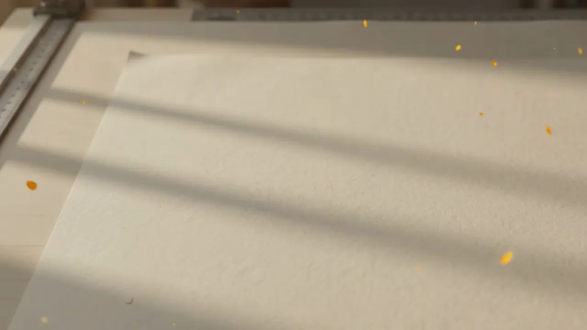
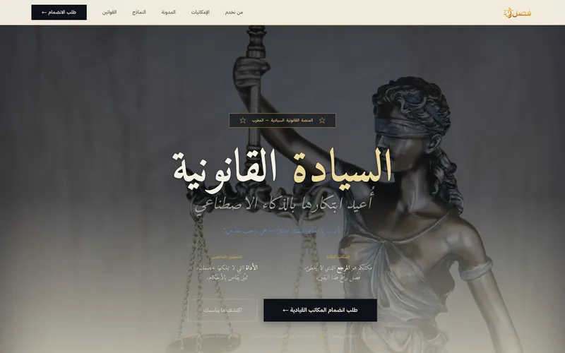
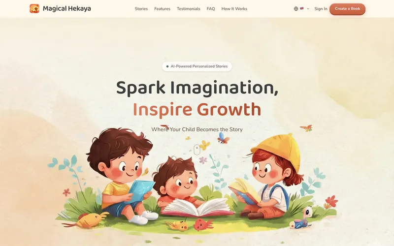
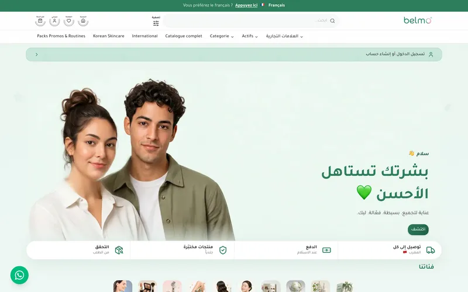
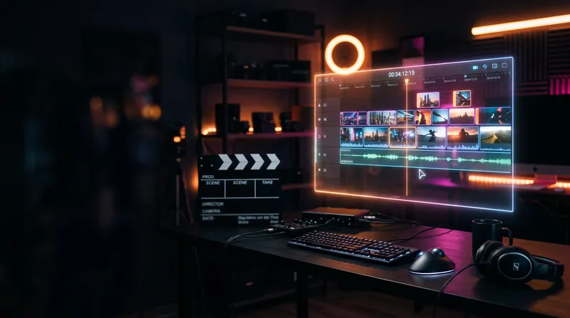
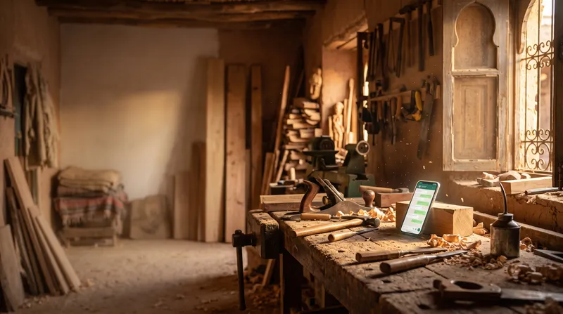
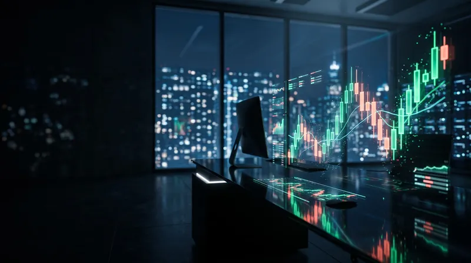
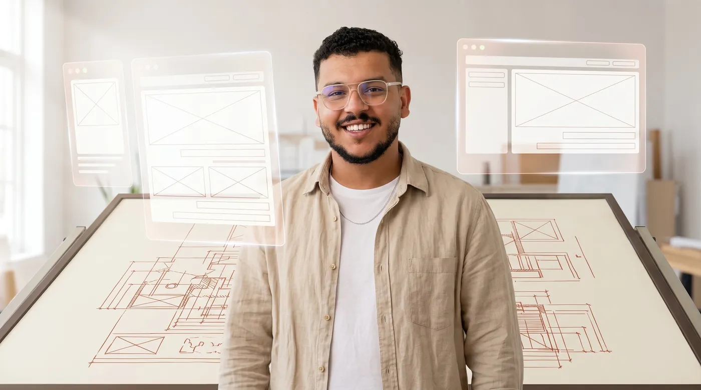

<div align="center">

# Faouzi El Bakri — Portfolio

**AI Engineer & Full-Stack Developer · Agadir, Morocco**

An editorial-cinematic portfolio built as one connected paper-cream world:
a hero film that assembles itself, case studies that scroll like stacked worlds,
and an About section split between two lives.

[faouzielbakri.com](https://faouzielbakri.com) · [LinkedIn](https://linkedin.com/in/faouzielbakri) · faouzielbakri@gmail.com



</div>

---

## The experience

- **Hero** — a terminal boots the page like a build: the name printed in ink over an ambient film (generated with Gemini Omni Flash by this repo's own asset pipeline), with a live build manifest riding along.
- **Selected work** — six featured case studies as full-viewport worlds that scroll over each other, each with its own palette, story component, and real product captures.
- **The index** — everything else that shipped: an editorial contact sheet on desktop, a sticky card deck that stacks on scroll on mobile.
- **About** — "By day I teach / by night I build": two portraits split by a draggable seam; on mobile the seam sweeps with scroll until a finger takes the handle.
- **Blog** — notes from production on LLM agents, RAG, and multi-agent pipelines, with `llms.txt` / `llms-full.txt` for AI search.
- **Contact** — a letter you finish instead of a form you fill, delivered by Resend with a mailto fallback that can never break.

## Featured work

| FASL | Magical Hekaya | Belmo |
| :--: | :--: | :--: |
|  |  |  |
| Multi-agent legal drafting, RAG over Moroccan law — **58.4K search impressions / 28 days**, avg position 6.2 | Kids star in their own printed storybooks — **paying customers**, **44K search impressions / 3 months** | Arabic-first K-beauty store, COD + 24–48h delivery — **818 registered clients, 629 orders this year** |

| Lakta | RESO Khdma | WebTrade |
| :--: | :--: | :--: |
|  |  |  |
| Brand kit in → finished Darija video ads out | WhatsApp AI agent matching workers to jobs, in Darija | Real-time trading UI with real money on the line |

…plus ten more client projects, own products, and concept rebuilds in the index.

## Stack

- **Next.js 16** (App Router, Turbopack) · **React 19** · TypeScript
- **Tailwind CSS v4** · **Motion 12** (scroll-linked worlds, springs, kinetic type)
- **Zod 4** validation · **Zustand** UI state · **Resend** contact delivery
- **Sharp** asset pipeline · **Gemini API** (`@google/genai`) for generated imagery & the hero film

## The asset pipeline

All AI-generated media (hero film, case-study art, portraits) is reproducible:

```bash
pnpm assets:screens    # capture real product screenshots (Playwright)
pnpm assets:generate   # generate media from assets/manifest.json via Gemini
```

Prompts, reference-image recipes, and identity-locking rules live in
[`docs/gemini-visuals-playbook.md`](docs/gemini-visuals-playbook.md).

## Running locally

```bash
pnpm install
pnpm dev          # http://localhost:3000
```

| Env var (`.env.local`) | Needed for |
| --- | --- |
| `RESEND_API_KEY` | Contact form delivery (falls back to mailto without it) |
| `GEMINI_API_KEY` | Regenerating AI media assets (optional) |
| `NEXT_PUBLIC_SITE_URL` | Canonical URL once the domain is live |

## Deploy

Any Node host works. Current target: **Hetzner + Dokploy** — connect this repo,
build with `pnpm build`, run `pnpm start`, set the env vars above.

<div align="center">



*Shipped from Agadir.*

</div>
